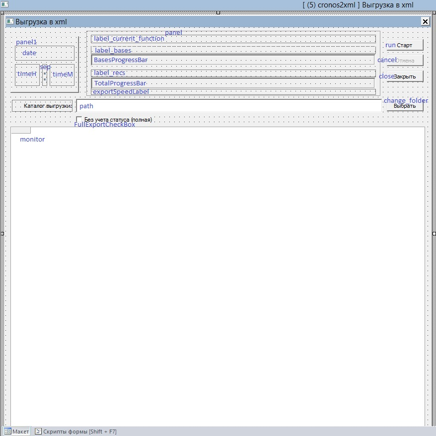
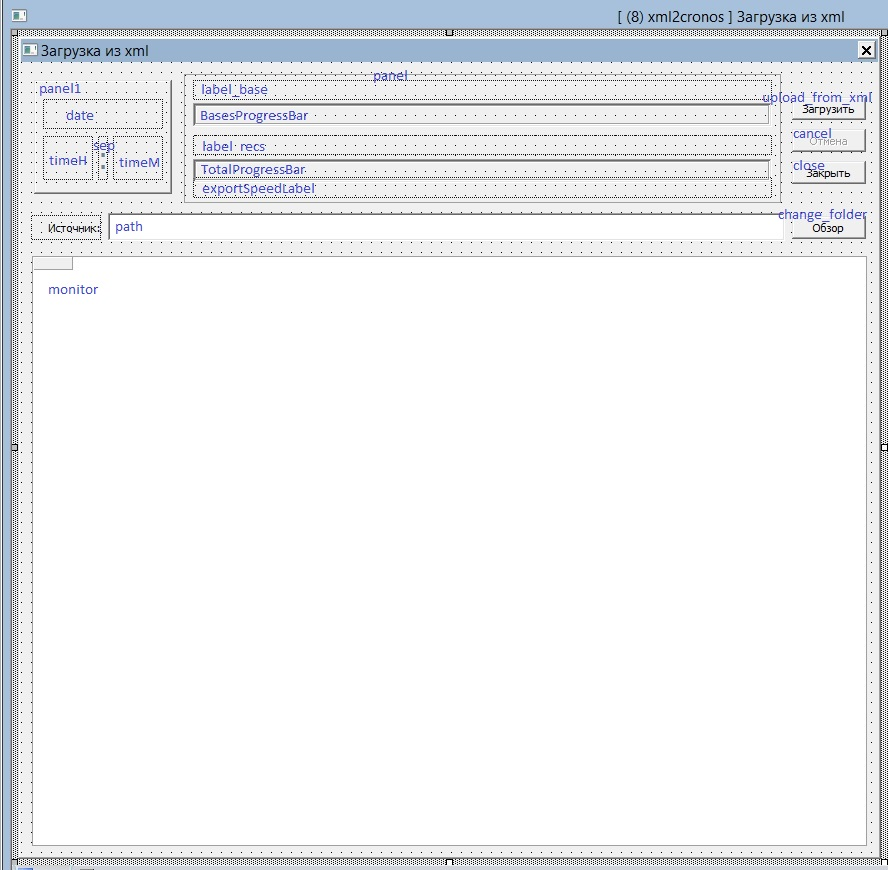

Модуль экспорта/импорта данных из/в СУБД "CronosPro" в/из XML
==

Представляет собой набор форм и скриптов. Подходит для экспорта банка данных любой структуры.
Для запуска необходимо создать в банке одноименные скрипты и сформировать аналогичные 
визуальные формы.

_Ниже приводится листинг только для скриптов. Код форм не имеет текстового представления, 
поэтому в примерах их скриншоты и для наглядности синим цветом подписаны имена элементов._

## Основные скрипты:
* [cronos2xml](cronos2xml.lua) &ndash; [Экспорт данных из СУБД "CronosPro" в XML](#export)
* [xml2cronos](xml2cronos.lua) &ndash; [Импорт данных из XML в СУБД "CronosPro"](#import)


## Вспомогательные скрипты:
* [guid](guid.lua) &ndash; формирование значения для поля `guid`
* [ProgressBar](ProgressBar.lua) &ndash; [класс инициализации прогресс бара](#progress_bar)

## Структура каталогов
При экспорте в целевом каталоге создаются, равно как при импорте ожидаются, подкаталоги:
 * _Data_ &ndash; имеет подкаталоги, именованные по мнемокоду базы, содержащие xml-файлы данных;
 * _Log_ &ndash; каталог хранения лог-файлов;
 * _Structure_ &ndash; содержит xml-файлы, описывающие структуру банка (один файл на одну базу).

---
## <a name="export">Экспорт данных</a>
Форма экспорта данных имеет следующий вид:


---
## <a name="import">Импорт данных</a>
Форма импорта данных имеет следующий вид:


---
## <a name="progress_bar">Инициализация и использование класса ProgressBar</a>
Класс реализует функцию прогресс-бара с использованием элемента формы `GroupBox`.

Пример использования:
```lua
local controlProgress = Me.ProgressGroupBox  -- объект Control GroupBox
local maxProgressValue = 100                 -- Максимальное значение прогресса
local progress = ProgressBar:new(controlProgress, maxProgressValue)
progress:InitBar()

for i = 1, 10000 do
    progress.NextStep()
end 
```
