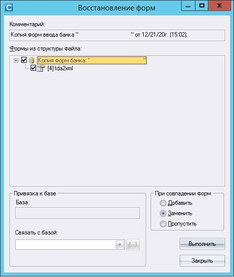
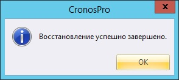
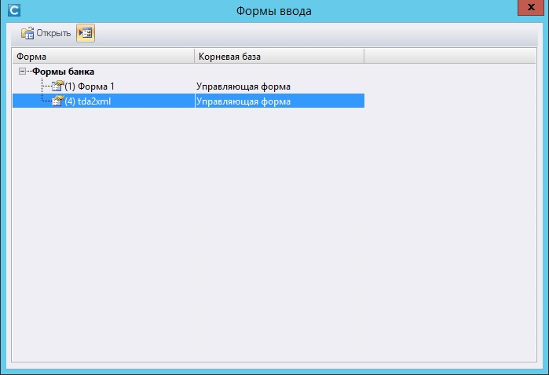
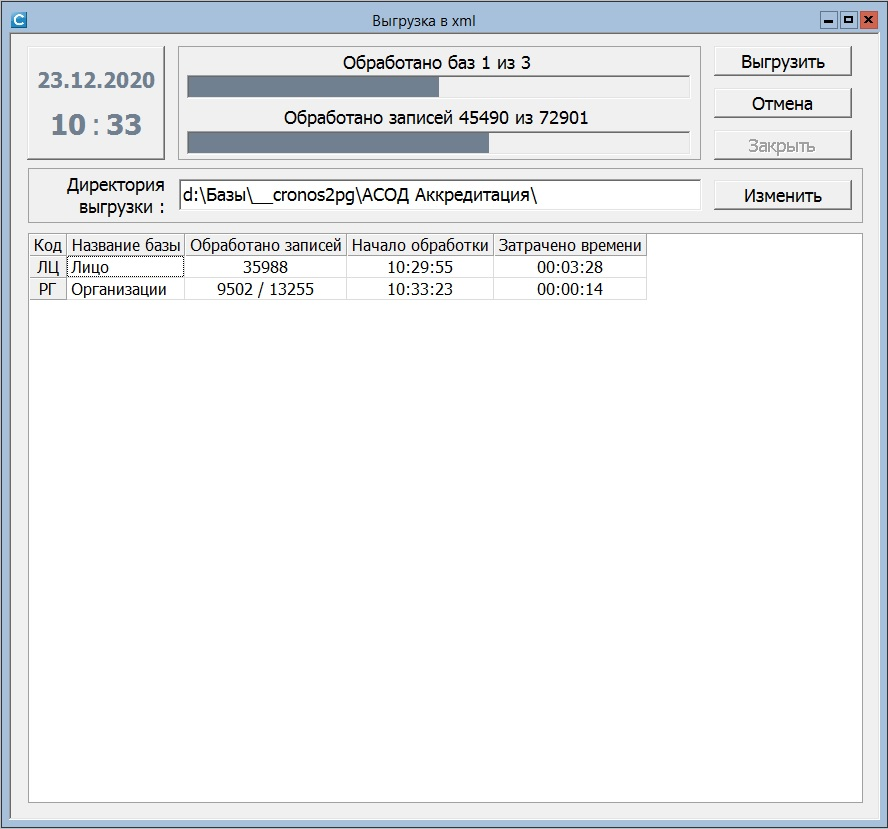
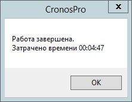

Конвертация данных из CronosPro в PostgreSQL (Виток-C)
=
_Термины:_

**_Каталог исходных данных_** &ndash; каталог хранения исходных файлов (`/_db/<имя_базы>/<имя_таблицы>`).

**_Рабочий каталог_** &ndash; каталог хранения скриптов загрузки (`/opt/loaders/<имя_базы>/<имя_таблицы>`).

**_Временная схема_** &ndash; схема, содержащая таблицы, сформированные в результате загрузки исходных данных.

---
_Содержание:_
* [Выгрузка исходных данных из СУБД "CronosPro" и их размещение](#preparation_files)
* [Загрузка данных во временную таблицу](#temporary_upload)
* [Подготовка запроса для сборки данных](#query_collector)
* [Окончательная загрузка данных](#clear_upload)

---
## <a name='preparation_files'>1. Выгрузка исходных данных из СУБД "CronosPro" и их размещение</a>
В окне приложения CronosPro из главного меню открыть диалог восстановления управляющей формы: 

`Администратор` &rArr; `Восстановление` &rArr; `Управляющих и входных форм банка`

[//]: # (Заменить скриншоты форм на актуальные)


Отметить пункт `[5] cronos2xml`, _при совпадении форм_ `Заменить` и нажать `Выполнить`.

По завершении программа сообщит об успешном завершении восстановления:



Далее необходимо открыть восстановленную форму. Для этого в главном меню нажать:

`Проектирование` &rArr; `Форм ввода` 

или `F5` на клавиатуре. 

_При наличии в банке данных иных форм, будет показан диалог выбора формы для открытия:_



Нажатием кнопки `Открыть`, выбрав при этом форму `(4) tda2xml`, или двойным кликом открыть форму.



В директории выгрузки указать каталог назначения и нажать `Выгрузить`. В процессе работы каждая база данных будет 
отображаться в новой строке с указанием прогресса импорта. По завершении работы выведется сообщение:



Выгруженные данные будут иметь следующую структуру:

```notebook
/Каталог_хранения/ 
    ./Structure/    - файлы с описанием структуры
        ./1_ISTOCHNIK_INFORMATSII.xml
        ./2_FIZICHESKIE_LITSA.xml
        ./<номер_базы_данных>_<танслит_имения_базы_данных>.xml
    ./Data/         - Каталог хранения файлов данных:
        ./AB/       - Каталог по мнемокоду базы данных CronosPro
        ./FL/       
        ...
            ./files/        - Каталог хранения файлов-приложений 
            ./part_1.xml    - файл данных 
            ...
            ./part_N.xml
```

Разместить полученные файлы в каталоге для обработки в каталог исходных данных. 
Чтобы его создать, выполнить команду:

```commandline
cd /target/directory
mkdir -p db_name/table_name
```

## <a name='temporary_upload'>2. Загрузка данных во временную таблицу</a>
В рабочем каталоге разместить файл `loader_temp.py`, содержащий следующий код:

```python
import pathlib

from cronos2pg.xml2pg import CronosDataXml2PG


root_dir = pathlib.Path().absolute()                  # Определяем абсолютный путь исполняемого файла 
SOURCE_PATH = r'/target/directory/db_name/table_name' # Каталог исходных данных
TEMP_PG_USER = 'user_name'                            # Имя пользователя для подключения к БД
TEMP_PG_PASSWORD = 'password'                         # Пароль
TEMP_PG_SCHEMA = root_dir.name                        # Имя схемы для размещения таблиц

if __name__ == '__main__':
    converter = CronosDataXml2PG(path=SOURCE_PATH, pg_schema=TEMP_PG_SCHEMA)
    if converter.connect_db(user=TEMP_PG_USER, password=TEMP_PG_PASSWORD):
        converter.import_data()
```
Для корректной работы скрипта необходимо перейти в каталог скрипта и уже оттуда запустить его выполнение:
```commandline
cd <рабочий_каталог>
python3 loader_temp.py
```

В каталоге `log` рабочего каталога размещены лог-файлы с результатами его выполнения:
```notebook
CronosData2PG.log
xml2pg.log
```

В результате импорта будет создана схема, указанная в константе `TEMP_PG_SCHEMA`, а внутри нее &ndash; таблицы в 
соответствии с базами данных CronosPro.
